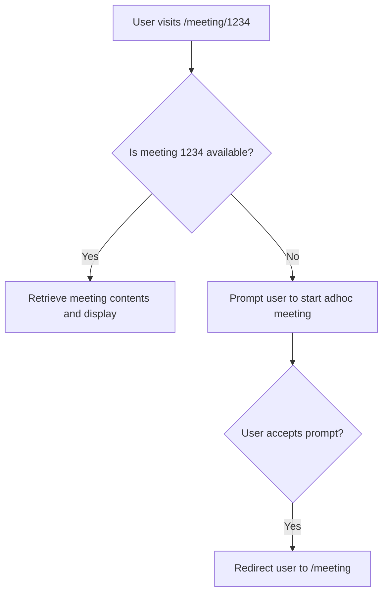

# Meeting Flow

Describe how a user experiences support for meetings.

```mermaid
  flowchart TD
    A[User visits /meeting/1234] --> B{Is meeting 1234 available?}
    B -- Yes --> C[Retrieve meeting contents and display]
    B -- No --> D[Prompt user to start adhoc meeting]
    D --> E{User accepts prompt?}
    E -- Yes --> F[Redirect user to /meeting]
```
